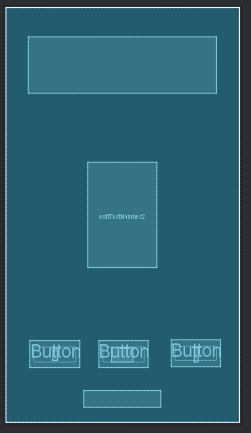
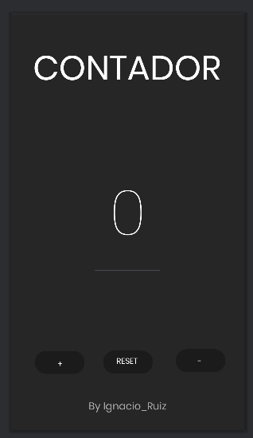

EJERCICIO 01
Deberás recrear en android la aplicación del contador que se os proporciona. 
El diseño se os pasará por figma (abajo teneis el enlace). En este primer 
ejercicio solo debes hacer la parte visual, nada de lógica. Asegurate de que
el resultado final sea identico al proporcionado, en tu criterio queda 
elegir el o los tipos de layouts que utilizarás. Mediante figma obtén el 
tipo de fuente, colores etc que debes utilizar en tu aplicación.

El contador se inicializa en 0 y ya desde ahi va aumentando.

Consta de 3 botones que te permitiran resetearlo, aumentarlo o disminuirlo, 
se utiliza un Constraint Layout para colocar los elementos y anclarlos a los bordes de la pantalla.

Este ejercicio se ha hecho utilizando Android Studio con la version 21 de la api JAVA.

EJERCICIO 02
Crea la segunda pantalla en el mismo proyecto(investiga como). Deberás realizar un lógin tal y como se muestra en el figma, en el caso de que el usuario y contraseña sean admin en el TextView de abajo saldrá “Usuario y contraseña correcta” en caso contrario “Usuario o contraseña incorrecta”. Investigar por vuestra cuenta como iniciar la aplicación en la Activity login. Pista → se configura en el AndroidManifest.xml. Una vez que iniciemos el login deberá pasar a la pantalla del contador pasando el dato del nombre del usuario (aparecerá en la parte baja de la pantalla de contador donde ponía “by nombre_alumno”)

En esta actualizacion hemos creado la pantalla de login mediante dos EditText uno para el nombre y otro para la contraseña, en caso de que el usuario introduzca el nombre y la contraseña adecuados,una vez
pulsa el boton de login, se pasa a la otra activity y empieza el contador hecho anteriormente.

